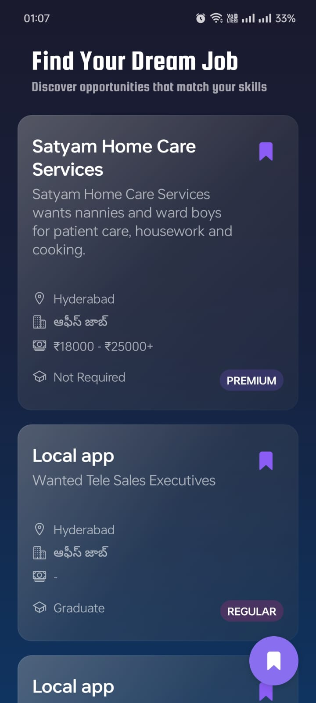
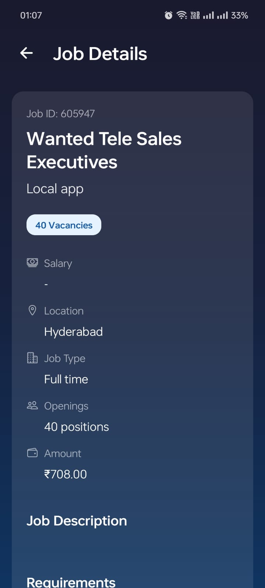
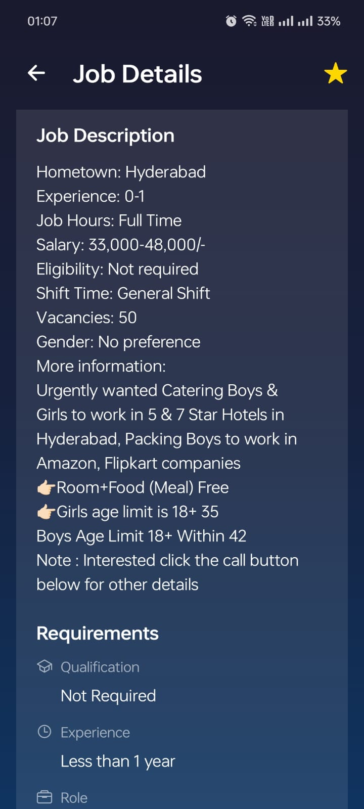
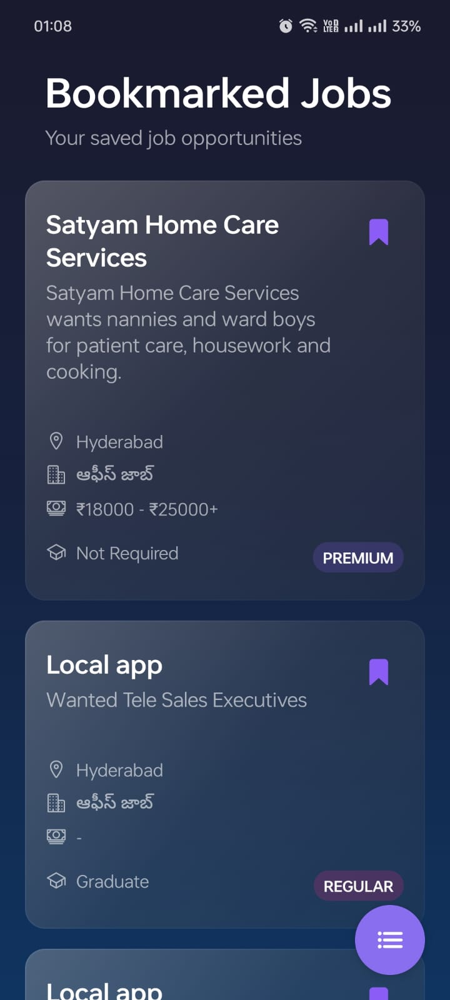
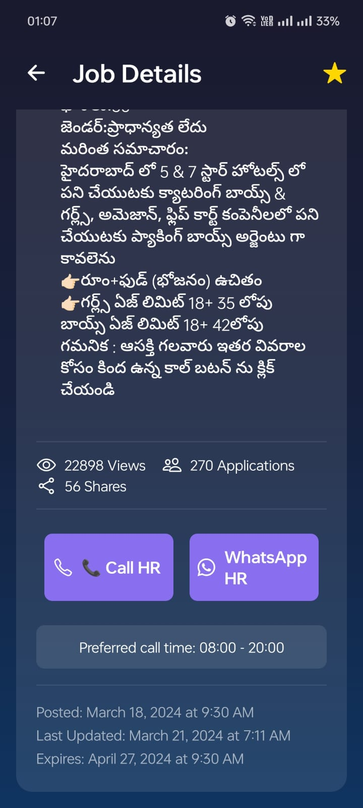
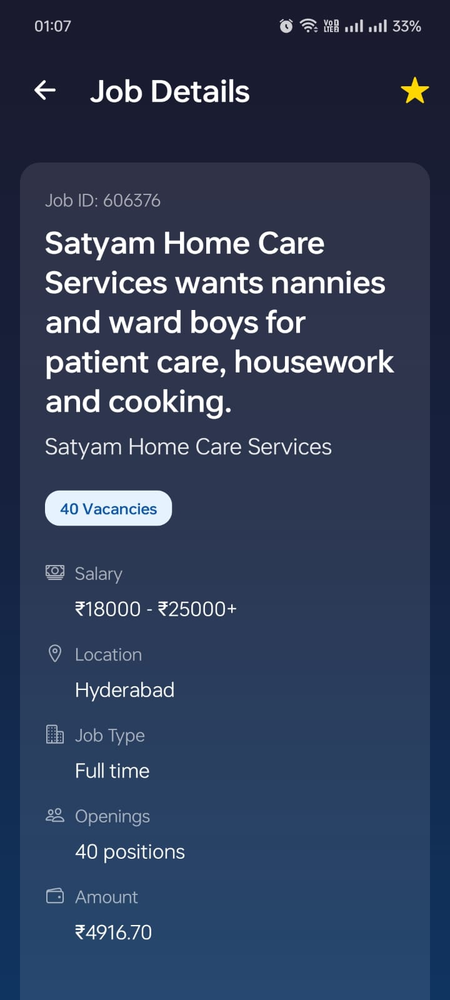

# Mobile Profession Finder

Crafted using React Native (in pure JavaScript) for an internship task with Lokal, this project should not be reused for personal or commercial endeavors outside of its original assignment scope. This contemporary app, built with Expo, provides a sleek and dark-themed interface for job seekers to browse and track listings in style.

## Main Highlights

- 📱 Stylish interface with dark mode
- 🔍 Job listings complete with details
- 🔖 Save preferred openings for easy recall
- 💫 Fluid animations between screens
- 🌈 Eye-catching gradients and blurred elements
- 📊 Special tagging for premium listings
- 🔄 Automatic synchronization of saved jobs

## Media Previews

### Sample Video


### Listing Overview & Details


*A primary page displaying different listings, including premium or standard labels and the option to bookmark*



*Detailed description, including employer data and role requirements*



*Comprehensive details such as compensation, location, and contact links*

### Bookmarks & Navigation


*A screen showing all bookmarked positions for quick reference*

### Further Information


*Job opening stats, contact info, and further details*



*Extensive overview with prerequisite criteria*

### Key Showcased Functionalities
- Purple-accented dark theme (#8B5CF6)
- Gradient backgrounds with blur for visual depth
- Distinction between regular and premium jobs
- Bookmark feature for future reference
- Detailed job breakdown
- Supports multiple languages (includes Telugu)
- Direct call/WhatsApp to HR
- Displays stats on views, applications, and shares
- Shows posting date plus expiration timeline

## Technical Components

- React Native
- Expo
- Navigation via Expo Router
- Storage persistence using AsyncStorage
- Expo Linear Gradient for visual effects
- Expo Blur for modern UI
- Ionicons for icons and visuals

## Getting Started

1. Clone this repository:
```bash
git clone [repository-url]
cd api_app

2. Install necessary packages:
npm install
# or
yarn install

3. Launch the app in development mode:
npm start
# or
yarn start

4. Run it on a device/emulator of your choice:
 - Press i for the iOS simulator (on Mac)
 - Press a for the Android emulator
 - Use the Expo Go app with its QR code for real devices

## Directory Layout
api_app/
├── app/
│   ├── _layout.js          # Core layout for navigation
│   ├── index.js            # Home listings screen
│   └── bookmarks.js        # Screen for saved listings
├── components/
│   ├── JobListingScreen.js
│   └── BookmarksScreen.js
├── App.js                  # Main application entry
└── package.json

Feature Breakdown
Listings
Shows various job postings
Highlights employer/title/major details
Premium vs. standard tags
Press interactions with visual feedback and bookmarking
Bookmarks
Provides quick access to all saved listings
Reacts instantly to additions or removals
Uses AsyncStorage for data retention
Handles empty states neatly
Visual Design
Dark mode theme with purple highlights (#8B5CF6)
Layered gradients
Subtle blur effects
Smooth transitions and animations
Bottom tab navigation
Custom tab styles
API Usage
Pulls data from a job-based API:

Base URL: https://testapi.getlokalapp.com
Endpoint: /common/jobs
Paging support for listing results
Filters job entries by category
Contributing Guidelines
Fork this repo
Create a new branch for your feature (git checkout -b feature/AmazingFeature)
Add commits (git commit -m 'Implement AwesomeFeature')
Push your branch (git push origin feature/AmazingFeature)
Propose changes via Pull Request
Licensing
Distributed under the MIT License (details in the LICENSE file).

Thanks To
Expo team for the platform
React Native community
Ionicons for icons
Lokal for the internship opportunity

## Contact
For any inquiries or feedback, please reach out to:
Udit Gaur - uditgaurbrk@gmail.com